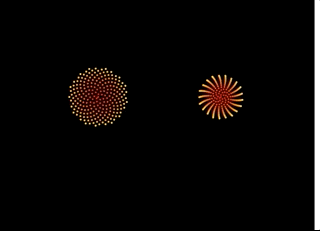

# Checkoff - "Phyllo-classy"

## I. Overview
- Mission: Modify the Phyllotaxis assignment to utilize an ES6 class
- Your starting point can be:
  - the completed version of your Phyllotaxis app from [PE-05 - Algorthmic Botany](../pe/pe-05.md)
  - OR the start file below (a demo version of Phyllotaxis from class)
  - Other resources:
    - [ES6 Object Notes](../notes/object-notes.md)
    - [ES6 Class Notes](../notes/es6-class-notes.md) - the start file and the `CircleSprite` class we built may be handy too

<hr>

## II. Start code
- Use this if you want, or use your PE-05 code

**phylloclassy-START.html**

```html
<!DOCTYPE html>
<html lang="en">
<head>
	<meta charset="utf-8" />
	<title>Phyllo-Classy Start</title>
	<style>canvas{ border: 1px solid black; }</style>
	<script>
	
	"use strict";
	const canvasWidth = 640, canvasHeight = 480;
	let n = 0;
	const divergence = 137.5;
	const c = 4;
	
	let ctx;

	function init(){
		ctx = canvas.getContext("2d");
		canvas.width = canvasWidth;
		canvas.height = canvasHeight;
		ctx.fillRect(0,0,canvasWidth,canvasHeight);
		loop();
	}
	
	function loop(){
                setTimeout(loop,1000/30);
		let a = n * dtr(divergence);
		let r = c * Math.sqrt(n);
		let x = r * Math.cos(a) + canvasWidth/2;
		let y = r * Math.sin(a) + canvasHeight/2;
		let color = `hsl(${n/5 % 361},100%,50%)`;
		drawCircle(ctx,x,y,2,color);
                n++;
	}


	// helpers
	function dtr(degrees){
		return degrees * (Math.PI/180);
	}

	function drawCircle(ctx,x,y,radius,color){
		ctx.save();
		ctx.fillStyle = color;
		ctx.beginPath();
		ctx.arc(x,y,radius,0,Math.PI * 2);
		ctx.closePath();
		ctx.fill();
		ctx.restore();
	}
	
	window.onload = init;

	</script>
</head>
<body>
<canvas id="canvas"></canvas>

</body>
</html>
```

<hr>

## III. Create the `PhylloFlower` class

- Convert the Phyllotaxis code to utilze an ES6 class named `PhylloFlower`, which has:
  - a `draw()` method that takes a `ctx` argument
  - a constructor that intitializes  `n`, `centerX`, `centerY`, `divergence` and `c` properties
    -  `n` should be initialized to `0` in your constructor
    -  The values of the other 4 properties must be passed into the constructor as parameters
  - the `dtr()` and `drawCircle()` code can get ported to this class

<hr>

## IV. Create instances of `PhylloFlower`

- Create 2 instances of `PhylloFlower` with distinct constructor values
  - You'll need a `sprites` array of course
  - You'll need `init` and `loop` methods
- Put them on the screen, one on the left side, the other on the right, and call their `draw()` methods
- Here's an example - for `new PhylloFlower(200,200,137.5,4)` and `new PhylloFlower(450,200,137.1,3)`

<hr>



<hr>

- Add additional constructor parameters if you want - an `fps` property for example - or a fucntion that calculates the `color` of each petal, etc

<hr>

## V. Submission

- You are free to put the `PhylloFlower` class in the HTML file, or in a separate JS file
  - if you have multiple HTML & JS files, name your root folder ***lastName-firstInitial*-phylloclassy**
  - if you have everything in just 1 HTML file, name your HTML file ***lastName-firstInitial*-phylloclassy.html**
- ZIP and post the folder (or file) to myCourses

