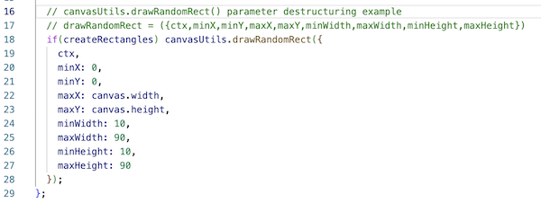

# Checkoff - Refactor the Canvas Screensaver

## I. Start code
- Your starting point will be the completed version. of [PE-04 - Canvas Screensaver](../pe/pe-04.md)
- This app is aready up to 200+ lines of code - we need to "clean it up" and do some refactoring

## II. Refactor the code!

- Create a folder named ***lastName-firstInitial*-screensaver-refactored**
- Make a copy of ***lastName-firstInitial*-cs-canvas-5.html**
  - name this copy ***lastName-firstInitial*-screensaver-done.html**
  - put the copy in the above folder you just created

### II-A. Meet the 330 coding standard

- Make sure that your HTML and JS is following our [IGME-330 class code standards](../notes/code-style-required-330.md)
  - examples:
  - `<button id="btnPlay">Play</button>` needs to be `<button id="btn-play">Play</button>`
  - `<button id="btnPause">Pause</button>` needs to be `<button id="btn-pause">Pause</button>`
  - `<input type="checkbox" id="cbRectangles">`needs to be `<input type="checkbox" id="cb-rectangles">`
  - etc
- Be sure to refactor your JS (and CSS if necessary) to match the new `id` values
- ***Test the app thoroughly to be sure it still works! Fix things as necessary. And then move on.***

### II-B. Arrow functions

- Convert ALL of the functions in the app to [arrow functions](../notes/js-functions.md#vi-b-arrow-function-examples)
  - this includes any anonymous and/or "wrapper" functions
- ***Test the app thoroughly to be sure it still works! Fix things and move code as necessary. And then move on.***

### II-C. Template Strings

- Replace all instances of *string concatenation* with [template strings](https://developer.mozilla.org/en-US/docs/Web/JavaScript/Reference/Template_literals)
  - for example - in the `getRandomColor()` function (this might be the only ocurrence of *string concatenation* you need to fix)
- ***Test the app thoroughly to be sure it still works! Fix things as necessary. And then move on.***

### II-D. External CSS
- Create a folder named **styles**
- Inside of this folder create a file named **default-styles.css**
- `<link>` to this file, and move all of the CSS styles into it

### II-E. ES6 Modules

- Convert the app over to ES6 module syntax
  - move all of the JavaScript to **src/main.js**
  - link to this file from your HTML file with a ``
    - get rid of `"use strict"` - you don't need it anymore
    - replace `window.onload=init` with `init()` (the call to `init()` will probably be at the bottom of **main.js**)
    - test the app and be sure it still works
- Now create **utils.js**, move the following functions to it, and `export` both of them:
  - `getRandomColor()` 
  - `getRandomInt()`
  - now `import` both functions into **main.js**
  - test the app - it should work as before
- Now create **canvas-utils.js**, move the following functions to it, and `export` all 3 of them:
  - `drawRectangle()`
  - `drawArc()`
  - `drawLine()`
  - now `import` these functions into **main.js**
    - you can `import` these normally OR
    - you `import` them using a *namespace* (using the `as` keyword - but if you do it this way, you'll need to add the namespace to every call to `drawRectangle()`, `drawArc()` and `drawLine()`
    - it's up to you which way to do it
  - test the app - it should work as before

## III. Discussion
- After deleting extraneous comments and moving code, **main.js** should be down to about 120 lines of code
- Note that we moved all of the *pure functions* (the one's that did not have "side effects") to one of the "utils" files
  - This is an advantage of writing pure functions, they are easy to "factor out", which will simplify your code
- And that functions such as:
  - `drawRandomRect()`
  - `drawRandomArc()`
  - `drawRandomLine()`
  - were *impure functions* because they were ***depending*** on the `width` of the canvas to function
  - so we left them in **main.js**

## IV. Optional Challenge

- Optional challenge: Turn those 3 "impure" functions into "pure" functions, and move them to **canvas-utils.js**
- This will cut **main.js** down to about 95 lines of code
- Here's an example:

- You might have noticed that some of these helper functions have very long function signatures
- One solution is to pass a *single object* as a function parameter, instead of a bunch of regular parameters
- Then use [object destructuring](https://developer.mozilla.org/en-US/docs/Web/JavaScript/Reference/Operators/Destructuring_assignment) syntax. That will get us *named parameters* - which are much easier to read:
  - https://www.geeksforgeeks.org/parameter-destructuring/
  - [More JS Notes#amed-parameters-in-functions](../notes/more-js.md#iii-named-parameters-in-functions)
  - here's an example. It's more verbose, but the named parameters make the function call much more readable:
  

## V. Submission

- ZIP and post the folder to myCourses
- The directory structure should look like this:

