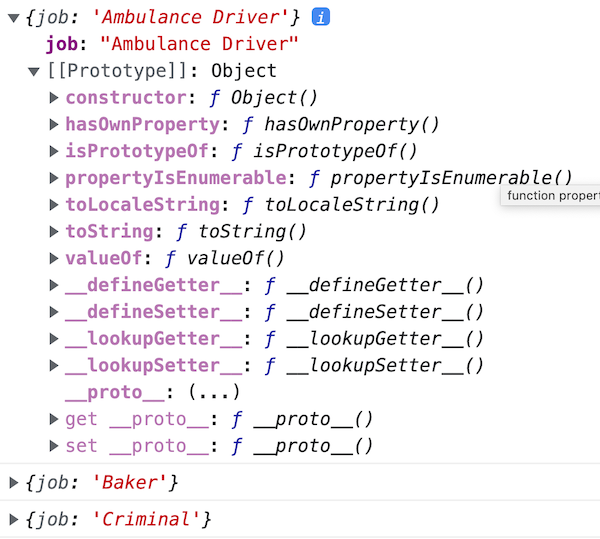

# ES6 Objects & Classes

## I. Objects in ES6

### I-A. Creation & Overview
- Objects are *"used to store various keyed collections and more complex entities."*
  - https://developer.mozilla.org/en-US/docs/Web/JavaScript/Reference/Global_Objects/Object
- Objects can be created using the [Object()](https://developer.mozilla.org/en-US/docs/Web/JavaScript/Reference/Global_Objects/Object/Object) constructor or the [object initializer / literal syntax](https://developer.mozilla.org/en-US/docs/Web/JavaScript/Reference/Operators/Object_initializer).
- For example:

```js
// we could use the Object() constructor to make a new object
let a = new Object();
a.job = "Ambulance Driver";
console.log(a);

// but more commonly we'll use object literal syntax
let b = {};
b.job = "Baker";
console.log(b);

// we can also give the object properties when we declare it
let c = {"job" : "Criminal"};
c.job = "Criminal";
console.log(c);
```

- Object keys (e.g. property names) are usally quoted strings - `"job"`
  - or they can be identifiers that are not quoted (as long as the identifier does not have spaces) - `job`
  - they can also be variables that are references to other objects - `jobRef`
- One very powerful (and potentially hazardous) feature of JS is that we can add more properties and even methods after an object is created:


```js
let d = {
  "name": "Danny",
  "sayHello": function(){ console.log(`Hello - my name is ${this.name}`);}
};

d.job = "Dog Walker";
d.sayGoodbye = function(){ console.log(`Goodbye - my job is ${this.job}`);}

console.log(d);
d.sayHello();
d.sayGoodbye();
```

- Note that in the console, we can see that both properties and both methods are present the `d` object, regardless of whether they were present when the object was created, or added later on"

```
{name: 'Danny', job: 'Dog Walker', sayHello: ƒ, sayGoodbye: ƒ}
```

<hr>

### I-B. Handy `Object` "class" methods

- If we "misspell" a property - it will get added to the object as a new property!

```js
d.joob = "Donut Maker"; // should be .job, not .joob
console.log(d); // {name: 'Danny', job: 'Dog Walker', joob: 'Donut Maker', sayHello: ƒ, sayGoodbye: ƒ}
```

- [`Object.seal()`](https://developer.mozilla.org/en-US/docs/Web/JavaScript/Reference/Global_Objects/Object/seal) will make it so we can't add properties to an existing object
  - new properties cannot be added to the passed in object
  - *"Attempting to delete or add properties to a sealed object, or to convert a data property to accessor or vice versa, will fail, either silently or by throwing a TypeError"*

```js
Object.seal(d);
d.naame = "Donut Maker"; // should be .name, not .naame - gives an ERROR or fails silently
console.log(d); // no .naame property was added
```

- [`Object.freeze()`](https://developer.mozilla.org/en-US/docs/Web/JavaScript/Reference/Global_Objects/Object/freeze) will make it so we can't add properties to an existing object OR modify existing ones
- *"Freezing an object prevents extensions and makes existing properties non-writable and non-configurable. A frozen object can no longer be changed: new properties cannot be added, existing properties cannot be removed, their enumerability, configurability, writability, or value cannot be changed, and the object's prototype cannot be re-assigned. freeze() returns the same object that was passed in. Freezing an object is the highest integrity level that JavaScript provides."*

```js
Object.freeze(d);
d.job = "Ditch Digger"; // cannot modify existing property
d.age = 55; // NOR add a new property
console.log(d); // no changes or new properties
```

- BTW: In JavaScript, arrays are objects too - and can be sealed and frozen

```js
const e = ["red","green","blue"];
e.push("cyan");
console.log(e); // ['red', 'green', 'blue', 'cyan']

Object.seal(e);
e.push("yellow"); // fails because we can't add index `4` (which is a property key) 
e[0] = "Maroon"; // but we CAN do this
console.log(e); // ['Maroon', 'green', 'blue', 'cyan']

Object.freeze(e);
e[1] = "Emerald"; // now this will fail too
```

<hr>

### I-C. Object Prototypes

- Note that all these first 3 objects we made above, all look the same in the console/debugger, no matter how they were created:

```js
{job: 'Ambulance Driver'}
{job: 'Baker'}
{job: 'Criminal'}
```

<hr>

- And if we take a look inside each object, we'll see that *"a typical object inherits properties (including methods) from `Object.prototype`, although these properties may be shadowed (a.k.a. overridden)"* 
  - Examples: meaning that these object literals have default `toString()` and `toValue()` methods, ways to define setters and getter, and so on



```js

```

<hr>

## II. Classes in ES6

- ES6 classes
  - [MDN Classes](https://developer.mozilla.org/en-US/docs/Web/JavaScript/Reference/Classes)
